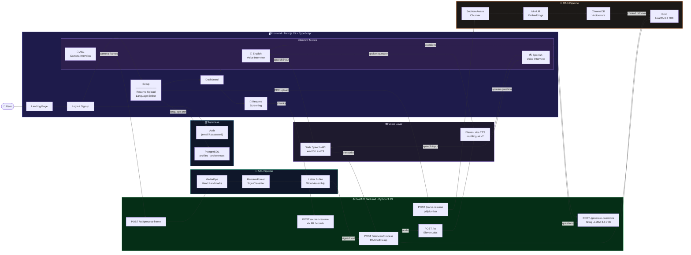

<h1 align="center">
  <br>
  
  <br>
  Smart Interview
  <br>
</h1>

<p align="center">
  <strong>AI-powered mock interview platform — personalized, multilingual, and fully accessible.</strong>
  <br />
  Supports English voice, Spanish voice, and American Sign Language.
</p>

<p align="center">
  
  
  
  
  
  
  
</p>

---

## What It Does

Smart Interview reads your resume and conducts a real mock interview — asking personalized technical questions based on your actual projects, skills, and experience. After each answer, it generates a contextual follow-up using RAG. The whole experience is available in **English**, **Spanish**, or **ASL**.

---

## System Architecture



---

## Key Features

| Feature | Description |
|---|---|
| **Resume-Aware Questions** | Parses your PDF and generates 8 targeted technical questions from your actual experience |
| **RAG Follow-Ups** | Every answer gets a contextual follow-up pulled from your resume via ChromaDB |
| **English Voice** | Web Speech API input + ElevenLabs TTS output |
| **Spanish Voice** | Full end-to-end Spanish — questions translated, responses understood, follow-ups in Spanish |
| **ASL Mode** | Camera-based hand landmark detection via MediaPipe + custom trained RandomForest classifier |
| **Resume Screening** | 4 ML models predict resume category, recommend job roles, and extract skills/education |
| **Interviewer Personas** | Randomized interviewer styles (startup CTO, staff engineer, etc.) per session |
| **Auth + Persistence** | Supabase-backed authentication, profile storage, and language preferences |

---

## Tech Stack

| Layer | Technology |
|---|---|
| **Frontend** | Next.js 15, React 19, TypeScript, Tailwind CSS, Framer Motion |
| **Backend** | FastAPI, Python 3.13, Uvicorn |
| **LLM** | Groq — LLaMA 3.3 70B (via OpenRouter-compatible client) |
| **RAG** | ChromaDB (in-memory), MiniLM embeddings, pdfplumber |
| **TTS** | ElevenLabs (`eleven_multilingual_v2` for Spanish, `eleven_turbo_v2` for English) |
| **Speech Input** | Web Speech API (`en-US` / `es-ES`) |
| **ASL** | MediaPipe Hand Landmarks + scikit-learn RandomForest classifier |
| **Auth & DB** | Supabase (PostgreSQL + Auth) |
| **3D / Visuals** | React Three Fiber, Three.js |

---

## Interview Flow

```
Upload Resume (PDF)
        │
        ▼
   Parse + Chunk ──► ChromaDB Vectorstore
        │
        ▼
  Select Language
  (English / Spanish / ASL)
        │
        ▼
  Generate Questions
  (8 Technical + 5 Behavioral via Groq)
        │
        ┌──────────────────────────┐
        │      Interview Loop      │
        │                          │
        │  Question spoken (TTS)   │
        │         │                │
        │  User answers            │
        │  (voice / ASL signs)     │
        │         │                │
        │  RAG retrieves context   │
        │         │                │
        │  Follow-up generated     │
        │         │                │
        │  Next question ◄─────────┘
        └──────────────────────────┘
```

---

## Getting Started

### Prerequisites
- Python 3.10+
- Node.js 20+
- API keys: Groq, ElevenLabs, Supabase, OpenRouter

### Backend

```bash
cd backend
pip install -r requirements.txt
uvicorn main:app --reload
# Runs on http://localhost:8000
```

### Frontend

```bash
cd frontend
npm install
npm run dev
# Runs on http://localhost:3000
```

### Environment Variables

Create a `.env` in the project root:

```env
GROQ_API_KEY=
OPENROUTER_API_KEY=
ELEVENLABS_API_KEY=
NEXT_PUBLIC_SUPABASE_URL=
NEXT_PUBLIC_SUPABASE_ANON_KEY=
NEXT_PUBLIC_API_URL=http://localhost:8000
```

### ASL Classifier (optional)

Download the [ASL Alphabet dataset](https://www.kaggle.com/datasets/grassknoted/asl-alphabet) and extract to `data/asl_alphabet_train/`, then:

```bash
python train_classifier.py
```

---

## Project Structure

```
smart_interview/
├── backend/
│   ├── main.py              # FastAPI app — all endpoints
│   └── requirements.txt
├── frontend/
│   └── src/app/
│       ├── (auth)/          # Login + Signup
│       ├── (dashboard)/
│       │   ├── dashboard/   # Main hub
│       │   ├── setup/       # Resume upload + language selection
│       │   ├── interview/   # Live interview (Voice + ASL)
│       │   └── screen/      # Resume screening results
│       └── page.tsx         # Landing page
├── rag/
│   ├── parser.py            # PDF extraction + section chunking
│   ├── vectorstore.py       # ChromaDB setup + querying
│   └── interviewer.py       # Groq LLM calls
├── asl/
│   ├── detector.py          # MediaPipe hand landmark extraction
│   ├── classifier.py        # RandomForest sign prediction
│   └── buffer.py            # Letter-to-word assembly
├── data/
│   └── behavioral_questions.json
├── model/                   # Trained ASL + resume screening models
└── train_classifier.py      # ASL model training script
```

---

<p align="center">Built for HackUSF 2026</p>
